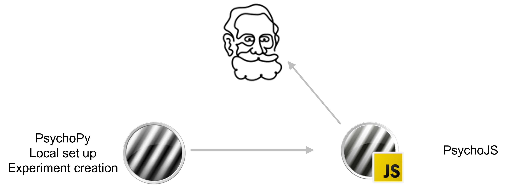
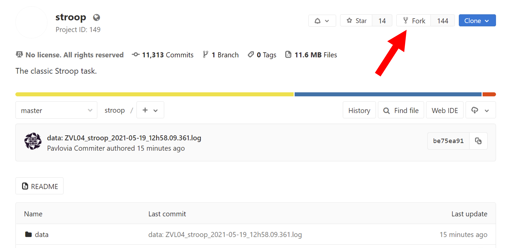
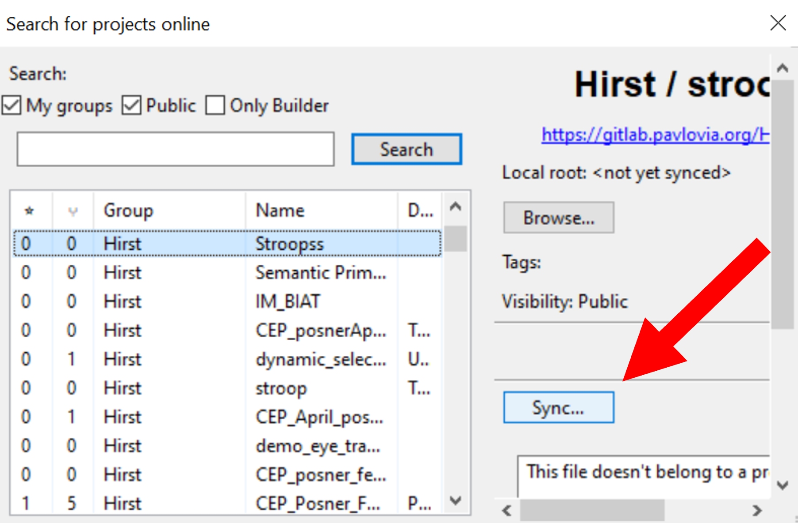

.. ifslides::

    .. image:: /_static/OST600.png
        :align: left
        :scale: 25 %

.. _online:

Running online studies
=================================

So now we have a very simple experiment that works locally, let's see how we would get that online. 

Before we take our study online it is important for us to understand a bit about how PsychoPy generates an experiment that can be read by your browser (using PsychoJS) as well as how we can host the study online (using pavlovia.org)

What is PsychoJS?
----------------------------

When we make an experiment in PsychoPy builder, it is writing our experiment in Python code under the hood. Now it also writes our experiment to JavaScript via PsychoPy's sister library `PsychoJS <https://psychopy.github.io/psychojs/>`_.

.. note::
    If you prefer to write experiments in pure code, you can write experiments purely in Javascript using PsychoJS, but in general it will be more flexible, less bug prone and easier to share with non-coders if you use Builder. 

What is Pavlovia?
----------------------------

Once we have our experiment written in JS, we need a way to "host" it online.  `Pavlovia <https://pavlovia.org/>`_ is a secure server for running experiments and storing data but it is also a good way to share your experiments publically with other researchers! Pavlovia is fully `GDPR complient <https://pavlovia.org/docs/home/ethics>`_.

.. ifslides::

    .. image:: ../_images/psychopy_pav_psychojs.png
    :align: center
    :scale:50%

Launching your studies on Pavlovia
=================================

Syncing our own study to pavlovia
----------------------------------

If the task that you need doesn't already exist - push your own! Before you get started try to make sure you:

*    Have a fresh folder that contains only **one .psyexp file and the resources needed by that file**. 
*   It can also be helpful to make sure your folder is not in a location already under git version control. 

.. nextSlide::

Once you have made your experiment and made sure that your local folders are organised neatly ( **with one .psyexp file in this location**) you're ready to sync your project to pavlovia!. 

.. nextSlide::

Once you have synced your study you will find it in your Dashboard on pavlovia.org under "Experiments". 

.. image:: ../_images/experiment_dashboard.png
    :align: left

.. nextSlide::

*   *Piloting versus running* - piloting will produce a token that lets you run your study for free for one hour, a data file will automatically download so that you can inspect it. Running will generate a URL to share with participants - no data will be downloaded locally using that link.
*   *CSV or DATABASE* - cav will generate a csv file per participant that will be sent to your gitlab repository (so it will be public if you make the repo public). Database will append all participants data to a single file (it will not be sent to gitlab).

.. nextSlide::

Inside the experiment settings of PsychoPy you can configure the online settings of your experiment. 

.. image:: ../_images/online_tab.png
    :align: left

The Pavlovia environment
=================================

What is free, what costs and why? 
---------------------------------

There are many features that we can use for free in pavlovia such as :

*   Version control
*   Public sharing of experiments

But to support the ongoing development of PsychoPy (which has been developed for free for years by `contributors <https://github.com/psychopy/psychopy/graphs/contributors>`_) a `small cost <https://pavlovia.org/store>`_ is introduced for **storing data** from experiments you run.

Finding openly shared experiments
----------------------------------

There are two ways we can find and use existing experiments from Pavlovia:

*   From within pavlovia itself using the `explore <https://pavlovia.org/explore>`_ tab. 
*   From within PsychoPy itself using the search globe. 

Finding shared experiments from Pavlovia itself
-------------------------------------------------

In the  `explore <https://pavlovia.org/explore>`_. tab each experiment has it's own icon. You can choose to run the experiment (if it is set to running) or view the code :code:`<>`

.. image:: ../_images/stroop_pavlovia.png
    :align: left
    :scale: 25 %

.. nextSlide::

We can then fork the experiment to our own "namespace" or a selected "gitlab group".

.. nextSlide::

Finally, we would use the search icon inside PsychoPy to search and sync:

Finding shared experiments from PsychoPy
-------------------------------------------------
Alternatively, we could just search from inside PsychoPy itself and "Fork +Sync" all at once

.. image:: ../_images/fork_local.png
    :align: left

.. nextSlide::

Since the second method is easier than the first, you might wonder "why bother" with the first approach? 

*   You can avoid some errors by deleting the data folder from the forked project *before* you clone/sync it locally (Web IDE > ... > delete > commit)
*   Can be easier for use with groups (online you can fork to a group, locally the project will always be forked to your namespace)

Gitlab
--------------------------

Benefits of GitLab (the important bits):
 - Fork existing projects
 - Version control
 - Add lab members to projects to work on the same files
 - Easy sharing of your task (open science) 

Making your task public
--------------------------

You can change the visibility of your task at any time under permissions. 

.. image:: ../_images/gitlabPermissions.png
    :align: center

.. ifslides::
    .. nextSlide::

One thing to note is that once you make your project "public" the data file stored there will also be public. 
    - good as allows easy data sharing
    - Something to bare in mind if you are collecting protected data

.. ifnotslides::
    .. note::
        Once you make your project "public" the data file stored there will also be public. 
            - good as allows easy data sharing
            - Something to bare in mind if you are collecting protected data

OK what next?
----------------------------------

So we have created a basic experiment, pushed it online and learnt about how we could share it. 

But what if we want something more complex?

Let's talk about some other types of responses we can get and how these can make our experiment more flexible.

:ref:`blockDesigns`

:ref:`codeComponents`

:ref:`mouse`

:ref:`typedResponses`