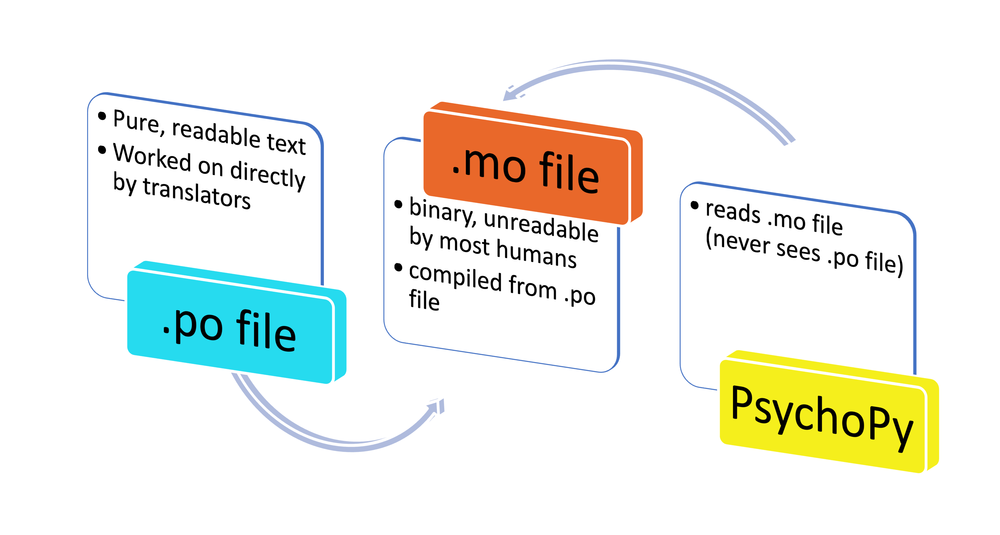

.. _translatorWorkshopIndex:

PsychoPy translation workshop
=====================================

These materials at:
https://workshops.psychopy.org/translators

Or you can `view as slides <https://workshops.psychopy.org/slides/translators>`_

Introductions and expectations
--------------------------------

- Who are we?
- Who are you?
- What are we trying to achieve?

Need for translations
-------------------------

- |PsychoPy| now used worldwide
- so needs to be available in different languages
- starting with v1.81

  - many parts of the |PsychoPy| app 
  
    - translatable into languages with unicode character sets
- a translation

  - changes the language that the **experiment-ER** sees
  
**NOTE**: This is **NOT** what the participant sees. **THAT** is under the control of the experimenter 

Overview of how |PsychoPy| works in a language other than US English
-----------------------------------------------------------------------

- |PsychoPy| uses `gettext` to "look" for a language every time it displays items to the experimenter (e.g., menu items, errors)
- If found

  - consults the ``messages.mo`` file under the directory for that language
- If **not** found

  - consults the ``messages.mo`` file under the directory (``en_US``) for American English
  
    - i.e., ``psychopy/app/locale/en_US/LC_MESSAGE/messages.po`` 

Visualisation
----------------

..

Further reading
-------------------
Further, highly optional reading for those who are interested in the programming aspect of this
   
- GNU *gettext*

  - `https://www.gnu.org/software/gettext <https://www.gnu.org/software/gettext/>`_ 
- *wxPython* 

  - `https://docs.wxpython.org/wx.Locale.html <https://docs.wxpython.org/wx.Locale.html>`_
 

Overview of how translators make this happen
-----------------------------------------------

Translators...

1. translate "strings" in a ``messages.po`` file
2. commit and push those changes to *GitHub*
3. make a *pull request* on *GitHub* to incorporate those changes in the current release of |PsychoPy|

**NOTE**: They also translate *Start-up tips*, but this is a slightly different process that involves a simple ``.txt`` file

Prerequisites to translating
-------------------------------

a thorough understanding of at least three things, requiring months or years of study:

- |PsychoPy| itself, as an experiment designer
- English
- any language (or dialect) that is not **American** English to translate into (e.g., Korean, Singapore English)

**NOT** prerequisites
-------------------------------------------

- how to use the free app `Poedit <https://poedit.net/>`_ to do translations
- how bring those translations into |PsychoPy| project using `Git <https://git-scm.com/>`_, usually via `GitHub <https://github.com/>`_
- Today's workshop mostly covers the topics on this slide

Quick overview of steps
--------------------------------

- preliminaries
- setting up the *git* / *GitHub* workflow
- working on translations
- making a pull request on *GitHub*
- cleaning up

Today
-----------------------------------

We're going to work through these one by one

.. toctree::
    :maxdepth: 1

    preliminaries.rst
    setUpGit.rst
    workOnTranslations.rst
    makePullRequest.rst

On to :ref:`preliminaries`