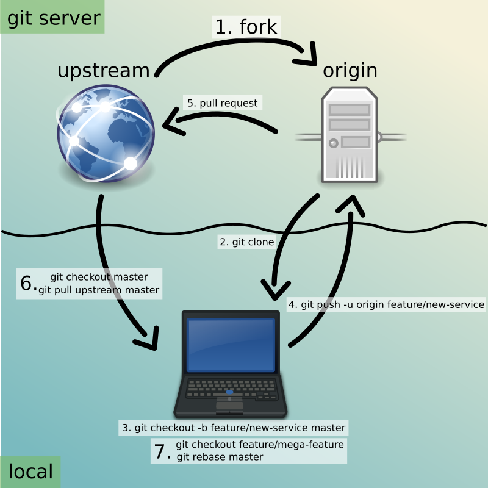
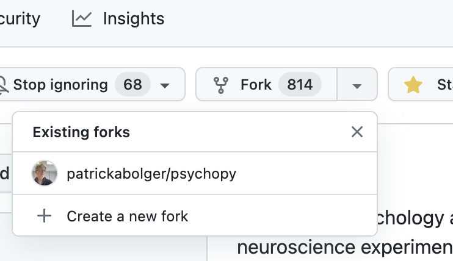

.. _setting up version control:

Setting up version control
===============================

- many tutorials on the web for this
- just the basics here

What is *version control*?
------------------------------

- A way to go "back and forth in time" to avoid ``FinalVersion1.docx``, ``FinalVersion2.docx``, etc.

  - For single documents, cloud-based platforms have a *Version History* 
 
    - e.g., in a *Google Doc*: ``File > Version History``
  - For a larger project, with multiple files and folders, there are several tools, the most popular of which is currently *Git*
    
What is *Git*?
----------------

- the most dominant tool worldwide for tracking and managing changes to software code and documentation

  - tracks an entire folder (not just a single file)
  
    - *repository* 
    
      - the folder (and all its subfolders) that you're tracking 
- runs on your computer (not online)

**NOTE**: *Git* works best with plain-text documents (UTF-8 encoding included), but not binary files like *Microsoft Word* or *Excel* documents

What is *GitHub*?
^^^^^^^^^^^^^^^^^^^^^

- a web-based service (not on your computer)
- centralizes *Git* repositories in the cloud
  
  - (literally an online *hub* for *Git* repositories) 
- simplifies collaboration

Basic *Git* workflow and terminology
^^^^^^^^^^^^^^^^^^^^^^^^^^^^^^^^^^^^^^^

..

(Creative Commons license, courtesy of openclipart.org, image `278845`, git-opensource-workflow, by *developingo*)

Setting up the *Git* workflow: step by step
-----------------------------------------------

Now we'll go through setting up the *Git* workflow for |PsychoPy|

Step 1: Get *Git* and *GitHub* working
----------------------------------------

- *Git* is free software for your computer
- *GitHub* is an free online system, for which you need to sign up

Step 1a: Install *Git*
^^^^^^^^^^^^^^^^^^^^^^^^^^

- download *Git* |downloadGitHere| 

  - (the binary installer is easiest)
  - You can just choose the defaults 

- If you need it, the following |watchGitInstallVideoHere| quickly shows you how to do this on both Mac and Windows
  
  - The Windows installation process involves clicking through more screens

.. |downloadGitHere| raw:: html

  <a href="https://git-scm.com/downloads" target="_blank">here</a>

.. |watchGitInstallVideoHere| raw:: html

  <a href="https://youtu.be/F02LEVYEmQw" target="_blank">YouTube video</a>

Step 1b: Sign up for *GitHub*
^^^^^^^^^^^^^^^^^^^^^^^^^^^^^^

- Go to |signUpForGithubHere|
- Click the following button: ``Sign up for GitHub``
- Provide your email, then create a password and username
- Verify that you're a human
- Enter the launchcode that was sent to your email
- You can accept the defaults through the rest of the options
  
  - If asked *How many team members will be working with you*
  
    - Just answer with: ``Just me`` 

.. |signUpForGithubHere| raw:: html

  <a href="https://github.com/" target="_blank">GitHub online</a>

Step 2: *Fork* the *psychopy* repository
------------------------------------------

- What is *forking* on *GitHub*?

  - for most users

    - just copying an existing repository already on *GitHub* somewhere
    - and making it your own, on your own, online *GitHub* account

**NOTE**: Technically and more generally, it's copying a repository, while also disconnecting it from previous committers

Step 2a: Find the *psychopy/psychopy* repository
^^^^^^^^^^^^^^^^^^^^^^^^^^^^^^^^^^^^^^^^^^^^^^^^^^

- While logged in to *GitHub*
    
  - Go to the search box at the upper left
    
    - type in: `psychopy`
  - You should see the following at the top of the search list: `psychopy/psychopy` 
  - Click it
  - You should land here: |landingPageForPsychopyPsychopyRepo|
  - You could also just type that URL in to your browser

.. |landingPageForPsychopyPsychopyRepo| raw:: html

  <a href="https://github.com/psychopy/psychopy" target="_blank">https://github.com/psychopy/psychopy</a>

..

Step 2b: *Fork* the *psychopy/psychopy* repository
^^^^^^^^^^^^^^^^^^^^^^^^^^^^^^^^^^^^^^^^^^^^^^^^^^^^^

- Find the ``Fork`` pull-down menu located near the upper right corner

..

- Choose the following: ``+ Create a new fork``
- **IMPORTANT**: Be sure to **UN**-Check the box labeled as follows: ``Copy the ____ branch only``

  - That is, copy **all** the branches 

What is a *fork*?
^^^^^^^^^^^^^^^^^^^^

- a *fork* is your own (online) copy (on *GitHub*) of the all the code required to build the current (in this case, *release*) version of |PsychoPy|
- it is "yours" in the sense that...
  
  - it is now disconnected from all other users
  - you are free to modify it 
  
    - for your own purposes (it's open source, after all); or
    - in order to contribute back to the project (more common)
  - In fact, the latter is what you'll be doing as translators

Step 3: download a tool to avoid using the command line (for now)
----------------------------------------------------------------------

- Command-line *Git* actually turns out to be very useful
- But it is often intimidating at first
- So there are many GUIs to make *Git* easier to use

Popular tools
^^^^^^^^^^^^^^^^^

- popular, but relatively complex GUI tools for working with *Git*

  - *GitKraken*, *PyCharm*, *Visual Studio Code*, etc.
- ideal starter option for translators: 

  - |homepageForGithubDesktop|
  - Why?

    1. free
    2. retains the native terminology of *Git*
    3. simpler, and therefore, less confusing

.. |homepageForGithubDesktop| raw:: html

    <a href="https://desktop.github.com" target="_blank">GitHub Desktop</a>

What if I use *Linux*?
^^^^^^^^^^^^^^^^^^^^^^^^

- *GitHub Desktop* not natively designed for *Linux* 
  
- If you're using *Linux*, try one of the following:
    
  - install the |githubDesktopForLinux| (see more options on the |shiftkeyDesktopFork|)
  - install |gitFiend|, which is cross-platform, but originally designed for *Linux*
    
    - just as easy to use as *GitHub Desktop*, perhaps easier
    - works on Windows and Mac as well

.. |githubDesktopForLinux| raw:: html

  <a href="https://medium.com/@lorenzozar/installing-github-desktop-on-linux-ec2aefa7ccdc" target="_blank">GitHub Desktop fork for Linux</a>

.. |gitFiend| raw:: html

  <a href="https://gitfiend.com/" target="_blank">GitFiend</a>

.. |shiftkeyDesktopFork| raw:: html

  <a href="https://github.com/shiftkey/desktop" target="_blank">the shiftkey/desktop fork</a>

Step 3a: Download and install *GitHub Desktop*
^^^^^^^^^^^^^^^^^^^^^^^^^^^^^^^^^^^^^^^^^^^^^^^^^

- Go to the homepage for |homepageForGithubDesktop|

  - Download and install the appropriate version
  
- Linux users can easily download |gitFiend|

Step 4: Cloning
------------------

- *Cloning* involves downloading files from an online *Git* repository to your computer
  
  - Unlike *forking* it doesn't disassociate anyone
  - So if you clone your online fork (which is just you)
  
    - you will remain as the sole committer 

Step 4a: How to start cloning from *GitHub Desktop*
^^^^^^^^^^^^^^^^^^^^^^^^^^^^^^^^^^^^^^^^^^^^^^^^^^^^^^

- in *GitHub Desktop* on a Mac

  - ``GitHub Desktop > Settings > Accounts``

    - Sign in using your credentials to *GitHub.com* (not *GitHub Enterprise*)
  - ``File > Clone repository``
    
    - choose *psychopy* 
  - (In *GitFiend*, you don't sign in. You just provide the repository URL, which can be found in the *GitHub* repository under the ``<> Code`` button, where you then choose the ``Local`` tab, then the ``https`` link)

Step 4b: How to finish cloning
^^^^^^^^^^^^^^^^^^^^^^^^^^^^^^^^^
  
- *psychopy* should be listed because it's already forked in your online account
 
  - under ``Local Path`` at the bottom, choose a **logical** place on your computer for the cloned repository (e.g., not your desktop)
  
    - click ``Clone``
    - This might take a minute, depending on your connection speed

The result of cloning
^^^^^^^^^^^^^^^^^^^^^^^^^

- full, updated\* copy on your local computer of all the files from current release of |PsychoPy|

  - including all the currently available localization folders
  - though you *may* need to add a new one (more on this soon)
- Fully connected to your online fork of the repository on *GitHub* 

\* It's updated at the moment you clone it, but as soon as someone else gets their commit(s) pulled in *upstream*, yours will be out of date. But there's a way to deal with this (which is the whole point of *Git*). I will cover this quite soon below.
 

Nomenclature after forking and cloning
-----------------------------------------

- **origin**

  - your fork of the original repository on *GitHub*
    
    - for *your* account, this is as follows
  
      - ``[your-github-account-name]/psychopy`` 
      - e.g., ``johndoe/psychopy``
- **upstream**

  - the original repository on *GitHub*
    
    - always as follows for |PsychoPy|
  
      - ``psychopy/psychopy``

What does all this mean?
---------------------------

- You have established the means to do the following:

  -  add translations to *PsychoPy* on your own computer
  -  **push** those changes to *origin* (i.e., your fork on *GitHub*)
  -  then "suggest" those changes to *upstream* (the original psychopy repo) through a **pull request** from **origin**

You're done setting up *Git* and *GitHub*
---------------------------------------------

- ... but... what about the *-flow* in *workflow*?
- The next section is about keeping your repository up to date

Step 5: Continual *Git* workflow
------------------------------------

- **synchronize your repository frequently with the upstream repository**
  
  - any time you begin work\*
  - helps you avoid *merge conflicts*
  
    - which might happen if two translators translate the same string 
  
- merge conflicts = minor headaches to fix by maintainers 
- but better to avoid them altogether

\* And follow up any work fairly soon with a commit, push, and pull request (more on this later)

5a: *Sync* (from *upstream*) to *origin*
^^^^^^^^^^^^^^^^^^^^^^^^^^^^^^^^^^^^^^^^^^^

- Go to your *fork* online
 
  - (again, this is your copy of the *psychopy* repository on *GitHub*, aka *origin*)
- Make sure you're on the *release* branch

  - (The pull-down menu at the upper-left shouldn't say ``dev``, but rather ``release``. Use that same pull-down menu to choose ``release`` if you have to)
- Click: ``Sync fork`` (located a bit to the right)\*
 
\* Note that this can only do something if there is, indeed, something new to synchronize from *upstream* 

5b: *Pull* from *origin*
^^^^^^^^^^^^^^^^^^^^^^^^^^^^^^^^^^^^^^^^^^^

- Go back to *GitHub Desktop* on your local machine
- Make sure you are on the *release* branch
- ``Repository > Pull``

  - This updates your local copy (your clone) with your fork (*origin*), which was just synchronized with the *upstream* repository
  - Now all three should be identical
- Complete this step after the one before it, each time before you begin work on a new set of translations 

  - The reason is that other translators on your team may have changed things since you last did, making your copy out of date

5c: A faster approach (no need to go online)
^^^^^^^^^^^^^^^^^^^^^^^^^^^^^^^^^^^^^^^^^^^^^^

- ``Branch > Merge into current branch``
- You will be given a choice of repos and branches, but **DO NOT GO WITH THE DEFAULT**\* 
- Instead, choose ``upstream/release``
  - (it might help to type ``release`` into the *Filter* box)  
- Click the tab at the upper right, which should *Push origin* along with an arrow and a number (the number of commits that it's pushing to *origin*)

\* Currently, the default is ``upstream/dev`` for some reason. We don't know how to change this in *GitHub Desktop* for the moment. Choosing that would merge the upstream *dev* branch into your local *release* branch, a disastrous merge.

5d: **AVOID** one method in *GitHub Desktop*
^^^^^^^^^^^^^^^^^^^^^^^^^^^^^^^^^^^^^^^^^^^^^^

- Do not choose the following

``Branch > Update from upstream/master``

- This would have the same disastrous effect as choosing the default (``upstream/dev``) in the previous slide

Step 6: Continual *Git* workflow
-----------------------------------

- Yes, this slide is repeated
- Why?

  - to emphasize that keeping one's repository up to date is a **common routine**

    - not something that you do once and forget about
    - or only do occasionally

On to :ref:`working on translations`