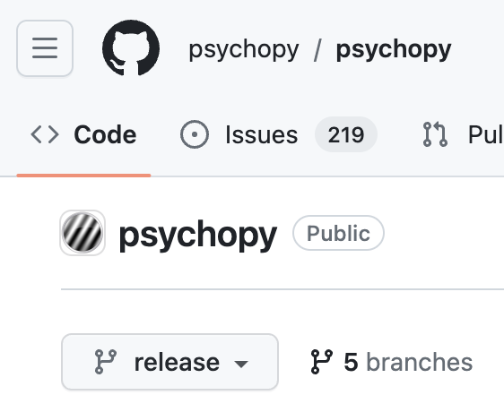

.. _setting up version control:

Setting up version control
===============================

- Many tutorials on the web for this
- We'll just go through the basics

But first of all, what is version control?
-----------------------------------------------

- Similar to *Google Drive* and *MS 365*
    
  - each tool (e.g., *Google Docs*) contains a *version history* 
    
    - go back and forth "in time" to look at (and even revert to) older versions of the document

- But what about mulitiple files and folders?
  
  - *Git* and *GitHub*
  - You can also go back and forth "in time"
    
    - More complex as they have to account for multiple documents
    
What is *Git*?
----------------

- the most dominant tool worldwide for tracking and managing changes to software code and documentation

  - tracks an entire folder (not just a single file)
  
    - folder and all its subfolders = *repository* 
  - runs on your computer (not online)

.. note::
   *Git* is designed to track plain-text documents, not binary files (e.g., *Microsoft Word* documents). Fortunately, translations are text, except for the ``.mo`` file (more on that later)

What is *GitHub*?
------------------

- a web-based service (not on your computer)
- centralizes *Git* repositories in the cloud
  
  - (literally an online *hub* for *Git* repositories) 
- much more convenient for collaboration on complex projects

Tools to interface with *Git* and *GitHub*
---------------------------------------------

- popular, but relatively sophisticated GUI tools for working with *Git*

  - *GitKraken*, *PyCharm*, *Visual Studio Code*, etc.
  
- ideal starter option for translators: 

  - *GitHub Desktop*

    - free
    - retains the native terminology of *Git*
    - less confusing in the end
- We will download and install *GitHub Desktop* in a bit

One disadvantages of *GitHub Desktop*
---------------------------------------

- Not designed for *Linux* 
  
    - If you're using *Linux*, try one of the following:
    
      - install the *GitHub Desktop* fork for Linux (`https://medium.com/@lorenzozar/installing-github-desktop-on-linux-ec2aefa7ccdc <https://medium.com/@lorenzozar/installing-github-desktop-on-linux-ec2aefa7ccdc>`_)
      - install *GitFiend* (`https://gitfiend.com/ <https://gitfiend.com/>`_), which is cross-platform, but originally designed for *Linux*
      
        - *GitFiend* seems to be just as easy to use as *GitHub Desktop*, perhaps easier

Important note on *Git* interfaces
-------------------------------------

- They are all windows into *Git*
- Therefore, you can switch between them seamlessly
- One will pick up where the other has left off
- This will make more sense later

Basic *Git* concepts/terms
----------------------------

From setup to workflow on GitHub

.. image:: ../_images/openSourceGitFlow.png
  :align: center
  :width: 550
  :alt: Image of a typical, seven-step workflow for open-source software projects, from initial setup to pull requests (Creative Commons license, courtesy of openclipart.org, image `278845`, git-opensource-workflow, by developingo)

..

(Creative Commons license, courtesy of openclipart.org, image `278845`, git-opensource-workflow, by developingo)

Step-by-step
----------------

Now we'll go through setting up the *Git* workflow for |PsychoPy|

Step 1: Get *Git* and *GitHub* working
----------------------------------------

Step 1a: Install *Git*
-------------------------

- download *Git* here: 

  - `https://git-scm.com/downloads <https://git-scm.com/downloads>`_
  - (the binary installer is easiest)
- The following *YouTube* video quickly shows you how to do this on both Mac and Windows

  - `https://youtu.be/F02LEVYEmQw <https://youtu.be/F02LEVYEmQw>`_ 
- The Windows installation process involves clicking through more screens

  - But you can just choose the defaults 

Step 1b: Sign up for *GitHub*
------------------------------

- Go to `https://github.com/ <https://github.com/>`_
- Click the button: ``Sign up for GitHub``
- Provide your email, then create a password and username
- Verify that you're a human
- Enter the launchcode that was sent to your email
- You can glide through the rest of the options
  
  - If asked *How many team members will be working with you*
  
    - Just answer with: ``Just me`` 

Step 2: *Fork* the *psychopy* repository
------------------------------------------

- *Forking* on *GitHub*

  - for most users

    - just copying an existing repository already on *GitHub* somewhere
    - and making it your own, on your own, online *GitHub* account

.. note:: 
   Technically and more generally, it's copying a repository, and disconnecting it from previous committers

Step 2a: Find the *psychopy* repository
-----------------------------------------

- While logged in to *GitHub*
    
  - Go to the search box at the upper left
    
    - type in: `psychopy`
  - You should see the following at the top of the search list: `psychopy/psychopy` 
  - Click it
  - You should land here: ``https://github.com/psychopy/psychopy``

Step 2b: Ensure you are on the *release* branch
------------------------------------------------

.. note:: 
   
   *Branches* are copies of a repository that can develop independently of each other, usually to be merged back together again later. More on this later.

- |PsychoPy| has two branches: *dev* and *release*
- How to check you are on the *release* branch: 

  - The pull-down menu near the upper left should say *release*, not *dev* (or anything else for that matter)

..

Step 2c: *Fork* the *release* branch
----------------------------------------

- Find the ``Fork`` pull-down menu located near the upper right corner

.. image:: ../_images/trnslWkshp_findForkMenu.png
  :align: center
  :width: 300
  :alt: Screenshot of where the pull-down menu is to fork a repository

..

- Choose the following: ``+ Create a new fork``
- Check the box labeled as follows: ``Copy the`` *release* ``branch only``

.. note:: 
   There's no need to fork the *dev* branch -- you *could*, but only if you wanted your translations to initially come out with the next major release for some reason

What is a *fork*?
------------------

- a *fork* is your own (online) copy (on *GitHub*) of the all the code required to build the current (in this case, *release*) version of |PsychoPy|
- it is "yours" in the sense that....
  
  - it is now disconnected from all other users (unless you add them)
  - you are free to modify it for your own purposes (unusual)
  - or modify it in order to contribute back to the project (common) 
- but it is **not** yours in the sense that...
  
  - you still need to abide by the the particular license that |PsychoPy| uses: 
    
    - `https://github.com/psychopy/psychopy/blob/dev/LICENSE <https://github.com/psychopy/psychopy/blob/dev/LICENSE>`_
    - `https://psychopy.org/about/index.html#license-for-use <https://psychopy.org/about/index.html#license-for-use>`_

Why just the *release* branch?
--------------------------------

- the *dev* branch

  - for *major* changes to |PsychoPy| that need to be tested extensively so that they don't "break" the software
  
    - new features
    - deprecation, etc.
  - Changes to the *dev* branch are released about twice a year only 
- The *release* branch 

  - for **minor** releases of |PsychoPy|, where changes can't really "break" anything
  
    - bug fixes, documentation typos, etc.
    - and critically, **translations**
  - Changes to the *release* branch are made public much more often

Step 3: Download and install *GitHub Desktop*
-----------------------------------------------

- Go to: `https://desktop.github.com/ <https://desktop.github.com/>`_ 
- Download and install the appropriate version
- Mac users with *Apple silicon* chips (*M1*, *M2*)
      
  - The website doesn't automatically detect whether you have such a processor
      
    - It seems to assume you have an *Intel* processor 
  - The appropriate download is under the heading at the bottom:
      
    - ``Apple silicon?``
  - Ultimately, the download should have an ``..arm-64`` extension instead of ``..x-64``

.. note:: 
   The *Intel* version will work, just a little bit slower as it has to go through *Rosetta 2*

Step 4: Clone the *psychopy* repository
-----------------------------------------

- *Cloning* involves downloading files to your computer
  
  - Unlike *forking* it doesn't disassociate anyone
  - So if you clone your online fork (which is just you),
  
    - You will remain as the sole committer 

Step 4a:                                            

- in *GitHub Desktop*

  - ``GitHub Desktop`` > ``Settings`` > ``Accounts``

    - Sign in using your credentials to *GitHub.com* (not *GitHub Enterprise*)
  - ``File`` > ``Clone repository``
    
    - choose *psychopy* 
  
.. note:: 
   *psychopy* should be listed because it's forked in your online account
 
     - under ``Local Path`` at the bottom, choose a **logical** place on your computer for the repository (e.g., not your desktop)
  
       - click ``Clone``
       - This might take a minute, depending on your connection speed

The result of cloning
-----------------------

- full copy on your local computer of all the files from current release of |PsychoPy|

  - including all the currently available localization folders
  - though you *may* need to add a new one (more on this soon)
 

Nomenclature after forking and cloning
-----------------------------------------

(at least the ones most people use)

- *Origin*

  - your fork of the original repository on *GitHub*
    
    - for *your* account, this is as follows
  
      - ``[your-github-account-name]/psychopy`` 
      - e.g., ``johndoe/psychopy``
- *Upstream*

  - the original repository on *GitHub*
    
    - always as follows for |PsychoPy|
  
      - ``psychopy/psychopy``

What does all this mean?
----------------------------

  - You have establish a back-and-forth between you and your online fork on *GitHub* 
  
    - You can manipulate files without interfering with anyone else
  - But now, you can contribute your changes to the original repository from via *pull requests* online
  
    - In GitHub jargon, you would make a *pull request* from *origin* to *upstream*

  - The importance of this will become clear later 

What about the name for the repository on my own computer?
------------------------------------------------------------

- no special name for the repository on your local computer

  - "my local copy"?

- *clone*(?)

  - would be a good name
  - but no one seems to use it
  
    - maybe because it's awkward to say, "I'm working on my clone" 
  - Fortunately, it's not important either

Done setting up *Git* and *GitHub*
------------------------------------

... but... What about the *-flow* in *workflow*?

Step 5: Continual *Git* workflow
------------------------------------

- **synchronize frequently across all repository instances**
  
  - any time you begin working "for the day" 
  - helps you avoid *merge conflicts*
  
    - a particular danger for translators in teams since they'll be working on the same files 
- the most likely candidate for a merge conflict:
  
  - compiled, binary ``.mo`` file
- merge conflicts = minor headaches to fix
- better to avoid them altogether

.. note:: 
   At the "end of the day," you follow this with a *commit*, a *push* and a *pull request*. We cover this later. 

5a: *Sync* to *origin*
-----------------------

- Go to your *fork* online
  - (your copy of the *psychopy* repository on *GitHub*, aka *origin*)
- Make sure you're on the *release* branch

  - the pull-down menu at the upper-left shouldn't say ``dev``, but rather ``release`` 
  
    - (use that same pull-down menu to choose ``release`` if you have to)
- Click: ``Sync fork`` (located a bit to the right)
 
  - (this only does anything if there is, indeed, something new to synchronize from *upstream*) 

5b: *Pull* from *origin*
--------------------------

- Go back to *GitHub Desktop* on your local machine
- ``Repository > Pull``

  - This updates your local copy (your clone) with your fork (*origin*), which was just synchronized with the *upstream* repository
  - Now all three should be identical
- Complete steps 5a and 5b each time before you begin work on a new set of translations 

  - The reason is that other translators on your team may have changed things since you last did 

Alternative: *pull* then *push*
-----------------------------------

There is an alternative to the *sync-pull* approach

- *pull* from *upstream*, then *push* to *origin*

.. note:: 
   I just tend not to do this since I (personally) am wary of interacting with *upstream* directly from my local repository. This is an artifact of me being new to *Git* myself.

- ``Branch > Update from upstream/master``
  
  - (It might tell you that it's already up to date) 
- ``Repository > Push`` (if there were changes from *upstream*)

Step 6: Continual *Git* workflow
-----------------------------------

- Yes, this slide is repeated
- Why?

  - to emphasize that keeping your different copies of the repository up to date is a **daily routine**

    - not something that you do once and forget about
    - or only do occasionally

On to :ref:`working on translations`