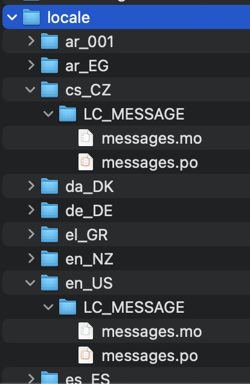
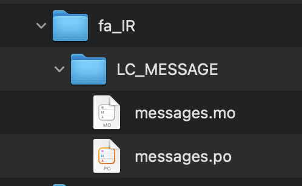

.. _working on translations:

Working on translations
==========================

- To be efficient, translators should follow a certain sequence of steps
- We will now cover how to do this

Overview
-------------

- (Step 0: Ensure you are on the ``release`` branch before you change anything)
- Step 1: Identify the appropriate 5-6 character ``ll_CC`` locale name for your translation
- Step 2: Edit the ``mappings.txt`` file
- Step 3: Work on main translations with *Poedit*
  
  - configure ``Poedit``
  - generate and translate "strings" in the ``messages.po`` file
- Step 4: Translate "Start-up tips" with a text editor
  
**NOTE**: Steps 3 and 4 aren't sequential; they're different translation processes

Step 0: Ensure you are on the ``release`` branch
--------------------------------------------------

- You might be on the ``dev`` branch by default
- Change this before you do any work

  -  In *GitHub Desktop*
  
    -  look for the ``Current Branch`` pull-down tab at the upper left 
    -  choose ``release`` from wherever it appears in the pull-down menu

Step 1: What is the ``ll_CC`` locale name for my language?
--------------------------------------------------------------

- First, we need to discuss how locale names work

- Look under this directory in your local copy

  - ``psychopy/psychopy/app/locale``

Screenshot of localization files in |PsychoPy|
^^^^^^^^^^^^^^^^^^^^^^^^^^^^^^^^^^^^^^^^^^^^^^^^^

..

1a: Examples of East Asian locale names
^^^^^^^^^^^^^^^^^^^^^^^^^^^^^^^^^^^^^^^^^^^

``ll_`` (language), followed by ``_CC`` (country), for example:

- |zh_CN| for Chinese in the PRC (simplified)
- |zh_TW| for Chinese in the ROC (complex)
- |ko_KR| for Korean in South Korea
- |th_TH| for Thai in Thailand

.. |zh_CN| raw:: html

  <a href="https://www.localeplanet.com/icu/zh-Hans-CN/index.html" target="_blank">zh_CN</a>

.. |zh_TW| raw:: html

  <a href="https://www.localeplanet.com/icu/zh-Hant-TW/index.html" target="_blank">zh_TW</a>

.. |ko_KR| raw:: html

  <a href="https://www.localeplanet.com/icu/ko-KR/index.html" target="_blank">ko_KR</a>

.. |th_TH| raw:: html

  <a href="https://www.localeplanet.com/icu/th-TH/index.html" target="_blank">th_TH</a>

1b: Examples of Central/Western Asian/European locale names
^^^^^^^^^^^^^^^^^^^^^^^^^^^^^^^^^^^^^^^^^^^^^^^^^^^^^^^^^^^^^

- |ar_001| for Modern Standard Arabic\*
- |he_IL| for Hebrew in Israel
- |tr_TR| for Turkish in Turkey
- |fa_IR| for Farsi in Iran

\* This is the official locale for MSA. Let's just hope the ``_001`` code works in |PsychoPy|. If not, we can switch to country codes (e.g., |ar_EG| for Arabic in Egypt)

.. |ar_001| raw:: html

  <a href="https://www.localeplanet.com/icu/ar-001/index.html" target="_blank">ar_001</a>

.. |he_IL| raw:: html

  <a href="https://www.localeplanet.com/icu/he-IL/index.html" target="_blank">he_IL</a>

.. |tr_TR| raw:: html

  <a href="https://www.localeplanet.com/icu/tr-TR/index.html" target="_blank">tr_TR</a>

.. |fa_IR| raw:: html

  <a href="https://www.localeplanet.com/icu/fa-IR/index.html" target="_blank">fa_IR</a>

.. |ar_EG| raw:: html

  <a href="https://www.localeplanet.com/icu/ar-EG/index.html" target="_blank">ar_EG</a>

1c: Some other Indo-European languages
^^^^^^^^^^^^^^^^^^^^^^^^^^^^^^^^^^^^^^^^^^^^^^^^^^^^^^^

- |ca_ES| for Catalonian/Valencian in Spain
- |de_DE| for German in Germany (hochdeutsch)
- |et_EE| for Estonian in Estonia
- |fr_FR| for French in France
- |hi_IN| for Hindi in India
- |it_IT| for Italian in Italy
- |lv_LV| for Latvian in Latvia
- |nl_BE| for Flemish in Belgium
- |pl_PL| for Polish in Poland
- |pt_PT| for Portuguese in Portugal
- |ru_RU| for Russian in Russia

.. |ca_ES| raw:: html

  <a href="https://www.localeplanet.com/icu/ca-ES/index.html" target="_blank">ca_ES</a>

.. |de_DE| raw:: html

  <a href="https://www.localeplanet.com/icu/de-DE/index.html" target="_blank">de_DE</a>

.. |et_EE| raw:: html

  <a href="https://www.localeplanet.com/icu/et-EE/index.html" target="_blank">et_EE</a>

.. |fr_FR| raw:: html

  <a href="https://www.localeplanet.com/icu/fr-FR/index.html" target="_blank">fr_FR</a>

.. |hi_IN| raw:: html

  <a href="https://www.localeplanet.com/icu/hi-IN/index.html" target="_blank">hi_IN</a>

.. |it_IT| raw:: html

  <a href="https://www.localeplanet.com/icu/it-IT/index.html" target="_blank">it_IT</a>

.. |lv_LV| raw:: html

  <a href="https://www.localeplanet.com/icu/lv-LV/index.html" target="_blank">lv_LV</a>

.. |nl_BE| raw:: html

  <a href="https://www.localeplanet.com/icu/nl-BE/index.html" target="_blank">nl_BE</a>

.. |pl_PL| raw:: html

  <a href="https://www.localeplanet.com/icu/pl-PL/index.html" target="_blank">pl_PL</a>

.. |pt_PT| raw:: html

  <a href="https://www.localeplanet.com/icu/pt-PT/index.html" target="_blank">pt_PT</a>

.. |ru_RU| raw:: html

  <a href="https://www.localeplanet.com/icu/ru-RU/index.html" target="_blank">ru_RU</a>

1d: What if our language needs more than one language variety?
^^^^^^^^^^^^^^^^^^^^^^^^^^^^^^^^^^^^^^^^^^^^^^^^^^^^^^^^^^^^^^^^^

- Recommendation

  - decide on which variety to start with
  - finish the translations for that variety of the language
  - copy, paste, rename, and adjust
  
1e: Example using Spanish
^^^^^^^^^^^^^^^^^^^^^^^^^^^

    - fully translate for Iberian Spanish (|es_ES|)
    - copy the entire ``es_ES`` folder
    - rename it to |es_CL| (Spanish in Chile)
    - add Chilean Spanish to the ``mappings.txt`` file
    - make adjustments to the new ``messages.po`` file to account for Chilean variations on the language  

.. |es_ES| raw:: html

  <a href="https://www.localeplanet.com/icu/es-ES/index.html" target="_blank">es_ES</a>

.. |es_CL| raw:: html

  <a href="https://www.localeplanet.com/icu/es-CL/index.html" target="_blank">es_CL</a>

1f: ``ll_CC`` folder/file structure
^^^^^^^^^^^^^^^^^^^^^^^^^^^^^^^^^^^^^^

- The file translators only work on

  - a ``messages.po`` file
  - located *two* levels under under any particular ``ll_CC`` folder for that *locale*
  
- For example for Farsi (Persian) in Iran: 

``psychopy/psychopy/app/locale/...`` 

..

**NOTE**: Ignore the intermediate ``LC_MESSAGE`` level, as well as the ``messages.mo`` file underneath

1g: Is your locale listed?
^^^^^^^^^^^^^^^^^^^^^^^^^^^^^

- Look under ``psychopy/psychopy/app/locale``

  - Is your ``ll_CC`` folder there?
  
    - may already be there
    - *or not*
- if not, why isn't it pre-listed?

  - unnecessary storage
  
    - pre-listing every language-country pair
    
      - storage waste
    - current list
    
      - just guesses

- if not pre-listed, just add it 

1h: How to add a locale
^^^^^^^^^^^^^^^^^^^^^^^^^

- the easy way

  - find any ``ll_CC`` folder

    - ideally, look for a small ``.po`` file with no translations yet
  - copy and paste the entire folder 
  - rename the folder to the ``ll_CC`` appropriate for your locale
    
  - make adjustments to the ``messages.po`` file underneath (covered soon)
- the hard way

  - not a reasonable approach; not going there  

Step 2: Update ``mappings.txt``
---------------------------------

- Do this once per translated language, and it's done forever (for that localisation)
- This file allows the experimenter to choose a localization in |PsychoPy|

2a: Open a text editor
^^^^^^^^^^^^^^^^^^^^^^^^^^^^^^^

- Start your preferred text editor (e.g., *Visual Studio Code*, *PyCharm*, *TextEdit* [Mac])
- Avoid using *Notepad* in *Microsoft Windows*

  - Use |linkToNotepadPlus| instead

.. |linkToNotepadPlus| raw:: html

  <a href="https://notepad-plus-plus.org/" target="_blank">Notepad Plus</a>

2b: Insert the appropriate ``ll_CC`` code
^^^^^^^^^^^^^^^^^^^^^^^^^^^^^^^^^^^^^^^^^^^^^

- Open the following file (there's one and only one)

``/psychopy/psychopy/app/localization/mappings.txt``

- Is the ``ll_CC`` code listed?

  - Make sure the ``ll_CC`` code resides at the appropriate line (alphabetically listed)

2c: Add the Microsoft language code
^^^^^^^^^^^^^^^^^^^^^^^^^^^^^^^^^^^^^^

- Add the 3-letter Microsoft code that refers to the language
  
  - These can be found in the rightmost column (``Language code``) on |microsoftListOfLanguageIDs|.
  
**NOTE**: If you can't find your language for some reason, just add a random three-letter sequence that isn't already in use and probably doesn't refer to a language (e.g., ``JJY``). That *should* work.

.. |microsoftListOfLanguageIDs| raw:: html

  <a href="https://learn.microsoft.com/en-us/previous-versions/windows/embedded/ms903928(v=msdn.10)" target="_blank">Microsoft's list of Language Identifiers and and Locales</a>

2d: Add an informative language label
^^^^^^^^^^^^^^^^^^^^^^^^^^^^^^^^^^^^^^^^

- At the far right,

  - type in the language and variety **in that language**
  
    - followed (in parentheses) by the the name of the language and variety, in English
  - do not include the variety (the part after the comma) if there is only one variety that anyone would ever use
  - for example

    - "``español, España (Spanish, Spain)``"

      - (not just "``Spanish``")
    - "``עִברִית (Hebrew)``"

      - (not just "``Hebrew``")
- Save the ``mappings.txt`` file

2e: Make a pull request for ``mappings.txt``
^^^^^^^^^^^^^^^^^^^^^^^^^^^^^^^^^^^^^^^^^^^^^^^^

2e1: Stage changes
^^^^^^^^^^^^^^^^^^^^^^^

- Select *psychopy* under the tab labeled ``Current Repository``
- Select *release* under the tab labeled ``Current Branch``
- Stage the ``mappings.txt`` file (only)

  - go to the tab labeled ``Changes`` 
  - make sure that ``mappings.txt`` is the only file with a checkmark

2e2: Commit staged changes 
^^^^^^^^^^^^^^^^^^^^^^^^^^^

- add the following message to the box underneath with the temporary text *Summary (required)*

  - ``DOCS: Update mappings.txt for Hebrew in Israel`` (for example)
    
    - this must be 50 characters or fewer
    - add extra information under ``Description``, if necessary 
- click the box underneath labeled ``Commit to release``
  
  - **NOTE**: If it's not labeled ``Commit to release``, start at the top of this slide again 

2e3: Push to *origin*
^^^^^^^^^^^^^^^^^^^^^^^^^^^
  
  - click the ``Push origin`` tab 

2e4: Pull request from *origin* to *upstream*
^^^^^^^^^^^^^^^^^^^^^^^^^^^^^^^^^^^^^^^^^^^^^^^^

- On *GitHub* (origin [AKA your online "fork"])

  - Click ``Contribute``
  - Choose ``Open pull request``
  - Leave a comment only if you think it's necessary (it shouldn't be for translations)
  - Click ``Create pull request``

**FINISHED!!** (with ``mappings.txt``)

Step 3: Translating strings in *Poedit*
------------------------------------------

- *Poedit*

  - where most of your work will be focused
  - first need to set some things up

3a: Sync all your repositories
^^^^^^^^^^^^^^^^^^^^^^^^^^^^^^^^^

- Sync from *upstream* to *origin*
- Pull from *origin*

**Again??!!**

- Yes

  - Do this **every time** you start work on a translation
  - Another translator may have changed the translation (the ``.po`` file) since the last time you worked on it
- Go back to the end of :ref:`setting up version control` for instructions

3b: Download and install *Poedit*
^^^^^^^^^^^^^^^^^^^^^^^^^^^^^^^^^^^^

|PoeditDownloadPage|

.. |poeditDownloadPage| raw:: html

  <a href="https://poedit.net/download" target="_blank">Poedit download page</a>

3c: Check ``General`` settings
^^^^^^^^^^^^^^^^^^^^^^^^^^^

- Start *Poedit*
- Once set, the settings below in *Poedit* don't really change

3c1: ``General`` tab (Name and email)
^^^^^^^^^^^^^^^^^^^^^^^^^^^

- choose the following: 

  - ``File > Preferences`` (on a PC)
  - ``Poedit > Settings`` (on a Mac)
- Find the following tab: ``General``
- For convenience, make sure that the box with the following label is **UN**-checked:

  - ``Automatically compile MO file when saving`` 
  
    - (Note that this is not strictly necessary as we have set Git to ignore the ``.mo`` file, but compiling this file is unnecessary and takes up processing time)

3c2: Leave name and email blank
^^^^^^^^^^^^^^^^^^^^^^^^^^^^^^^^^^^^

- Do not provide your name or email

  - Doing so will list your name and email in a public place (GitHub), where it doesn't really need to be  
- Instead, just leave these fields blank

3c3: check the ``Advanced`` settings
^^^^^^^^^^^^^^^^^^^^^^^^^^^^^^^^^^^^^

- click the ``Advanced`` tab in the same window
- Make sure that the following are set correctly

  - ``Line endings:``
  
    - set to ``Unix (recommended)``
  - ``Preserve formatting of existing files``
    
    - make sure this is checked

3d: Settings specific to a ``.po`` file
^^^^^^^^^^^^^^^^^^^^^^^^^^^^^^^^^^^^^^^^^^

First, open the ``.po`` file

- ``File > Open``
  
  - find the ``.po`` file for the language you're working on:
  
    - ``.../psychopy/psychopy/app/locale/[your ll_CC folder]/LC_MESSAGES/messages.po``

- For example, for Thai in Thailand:

  - ``psychopy/app/locale/th_TH/LC_MESSAGES/messages.po``

3d1: language team
^^^^^^^^^^^^^^^^^^^^^^^

- Go to: ``Translation > Properties``
- under: ``Language team`` (if there is more than one translator for the locale, and we have set up a *Google Group* for your team)

  - make sure that the email for entire group is correct
  
    - ``psychopy_[language]@opensciencetools.org``
    
      - e.g., ``psychopy_hebrew@opensciencetools.org``

3d2: language
^^^^^^^^^^^^^^^^^
- under: ``Language``
  
  - select the appropriate ``Language (Country)`` combination
  - For example
  
    - ``Duala (Cameroon)``
- under ``Charset``

  - ``UTF-8 (recommended)``  

3d3: Paths (1)
^^^^^^^^^^^^^^^^^^^

- under the tab labeled: ``Sources Paths``

  - For ``Base path``
  
    - Click the arrow on the right
    - find the path on your computer that leads to the ``psychopy`` directory *within* the cloned repository on your computer:
      
``..THE/PATH/ON/YOUR/COMPUTER/TO/psychopy/psychopy``

**NOTE**: This setting does **not** make its way into the ``.po`` file. Rather, it's just part of *Poedit*. 

3d4: Paths (2)
^^^^^^^^^^^^^^^^^^^

- under the tab labeled: ``Sources Paths``...
- in the box labeled: ``Paths``...
- there should be a dot (``.``)

3d5: keywords
^^^^^^^^^^^^^^^^^^^^

- under the tab labeled: ``Sources Keywords``

  - Go to: ``Additional keywords``
- The following keyword should be in that box (with the preceding underscore): 
 
``_translate`` 

- If it **isn't**, type it in  
- Save your work (``File > Save``)

3e1: Generate current list of translatable strings
^^^^^^^^^^^^^^^^^^^^^^^^^^^^^^^^^^^^^^^^^^^^^^^^^^^

- The elements you can translate are called *strings*

  - This process is straightforward if you are the sole translator on the language
- But translation teams can run into merge conflicts
  
  - In such cases, make sure that you reduce the chances of merge conflicts by doing the following

    1. synchronise your repositories
    2. establish a team strategy (covered after the next slide)

3e2: Generate the list
^^^^^^^^^^^^^^^^^^^^^^^^^
 
- Choose: ``Translation > Update from Source Code``
- You should subsequently see a list of strings in English that need translating into your language
  
  - If you don't, the keyword ``_translate`` may not have been added to the keywords (see above)

**NOTE**: If ``Update from Source Code`` is greyed out, there are probably no new strings to update

3g: Group strategy: Sort and show string ID 
-----------------------------------------------

- This is for collaboration in a team, after the strings are updated

  - Choose: ``View > Show String ID``
  - Choose: ``View > Sort by File Order``
- If you do both of those, then the strings will be listed in order by index

  - The index ``ID`` can be seen in the column at the far right
  - Teams can divide up the work by ``ID`` ranges, for example
  
    - Translator A: IDs 1-250
    - Translator B: IDs 251-500
    - etc. 

3h: Translate the strings
-------------------------------

- Look at the list under the heading: ``Source Text - English`` at the upper left
- Select a string that you want to translate
- Once selected, you should see it appear as English in the following box below the longer list: ``Source text`` (at the lower left)
- Below that, there is a box labeled as follows: ``Translation``
- Type your translation into that box
- Save your work as you go

3i: Make a pull request for ``messages.po``
----------------------------------------------

- This involves several steps, described next

3i1: Stage changes
^^^^^^^^^^^^^^^^^^^^^^^^^

- Select *psychopy* under the tab labeled ``Current Repository``
- Select *release* under the tab labeled ``Current Branch``
- Stage the ``messages.po`` file (only)

  - go to the tab labeled ``Changes`` 
  - make sure that ``messages.po`` is the only file with a checkmark
  
    - if the ``.mo`` file is checked, **UN**-check it

3i2: Commit staged changes
^^^^^^^^^^^^^^^^^^^^^^^^^^^^^^^

- add the following message to the box underneath with the temporary text *Summary (required)*

  - ``DOCS: Add translations to Modern Standard Arabic`` (for example)
  - ``DOCS: Add translations to Simplified Chinese`` (another example)
    
    - (again, must be 50 characters or fewer; add extra information under ``Description``, if necessary) 
  - (ignore the box labeled ``Description`` for now)
- click the box underneath labeled ``Commit to release``
  
  - **NOTE**: If it's not labeled ``Commit to release``, start at the top of this slide again 

3i3: Push changes to *origin*
^^^^^^^^^^^^^^^^^^^^^^^^^^^^^^^
  
- click the ``Push origin`` tab 

3i4: pull request to *upstream*
^^^^^^^^^^^^^^^^^^^^^^^^^^^^^^^

- On *GitHub* (origin [AKA your online "fork"])

  - Click ``Compare & pull request``
  - Make sure it says *Able to merge* in the box at the top
  - Leave a comment only if you think it's necessary (it shouldn't be for translations)
  - Click ``Create pull request``

Note A: Leave certain technical terms alone
---------------------------------------------

- Technical terms should not be translated:
  
  - ``Builder``
  - ``Coder``
  - ``PsychoPy``
  - ``Flow``
  - ``Routine``
  - and so on
- These are usually indicated with an uppercase first letter
- Check the Japanese localization (``ja_JP/LC_MESSAGES/messages.po``) if in doubt

  - The Simplified Chinese ``.po`` file also has some examples

Note B: Formatting arguments
------------------------------

If there are formatting arguments in the original string (``%s``, ``%(first)i``)

- The same number of arguments must also appear in the translation\*
- If they are named (e.g., ``%(first)i``)

  - (here, ``first`` is a python name)
  - that part should not be translated
- Again, refer to the Japanese localization if in doubt

  - (and/or Simplified Chinese, if you are in that language)

\* Word order changes across languages, of course. So the placement of these formatting arguments within the translated string may differ from the US-English string. 

Note C1: Using the Japanese ``.po`` file for guidance
-------------------------------------------------------

- The Japanese translation is nearly complete
- You have it since you forked and cloned the repository
- Open: 

``/psychopy/app/locale/ja_JP/LC_MESSAGES/messages.po``

- Look up the string you're having difficulty with in the Japanese ``messages.po`` file
- Use that as a model for your own ``.po`` file

   - (and/or Simplified Chinese, if you are in that language)

Note C2: When you are unsure how to translate
------------------------------------------------

If you think your translation might have room for improvement

- toggle the button labeled as follows: ``Needs Work``

  - It should be located to the right of the header with the following label: ``Translation``
- You can also add notes to clarify

  - Click the button with the following label: ``Add Comment`` 
  
    - This should be located at lower-right of the app window if you have the sidebar visible
  - Add your notes for that string into the pop-up window

Note C2a: Simple strategy to resolve uncertainty: Ask the experts
-------------------------------------------------------------------
  
- Go to the |discoursePageForPsychopy|
- There are friendly, useful experts there

  - When posting
  
    - select *Development* under ``Category``
    - add the tag *translation*
  - How people on the Forum might help you
  
    - Few, if any, can help you with your language, of course
    - Many more who can help you understand the underlying code of |PsychoPy|

.. |discoursePageForPsychopy| raw:: html

  <a href="https://discourse.psychopy.org/" target="_blank">PsychoPy Forum</a>

Note C2b: Advanced strategy to resolve uncertainty: *Determine it yourself*
----------------------------------------------------------------------------

**NOTE**: You need to understand *Python* quite well to take the following approach

- Select the relevant string in the following box: ``Source text - English``

  - Right-click the string (control-click on a Mac)
- At the bottom of the pop-up window, you should see the following heading: ``Code Occurrences`` 

  - Below that, you will see the (partial) path(s) to the file(s), followed by a colon, ``:``, then the respective line number in the file

Note C2b (cont'd)
------------------

- For example, for the string ``Yes`` in one version of |PsychoPy|:

  - ``../app/connections/update.py:232`` (meaning line 232 in the ``update.py`` file under the ``connections`` folder)

  - ``../app/dialogues.py:51`` (meaning line 51 in the ``dialogues.py`` file under the ``app`` folder)

  - ``../app/dialogues.py:71`` (etc.)

- You can then go into that file (or those files) to determine the function   

Note C2c: Last resort: *Do nothing*
-------------------------------------

If still in doubt
  
- Just leave out the translation until you *do* understand
- There is nothing wrong with this approach
- It is, by far, preferable to mis-translating a string  
- If you see fit to do so, toggle ``Needs Work`` and add a comment (see above)

Step 4: Translating the *Start-up Tips*
-------------------------------------------

- *Start-up tips* are not handled directly in a ``.po`` file
- Rather, they are stored in a ``.txt`` file, one per language
- That ``.txt`` file is then referred to inside the ``.po`` file for your language
- This is explained next

4a: Copy ``tips.txt`` to a new file
^^^^^^^^^^^^^^^^^^^^^^^^^^^^^^^^^^^^^^^

- Find the default *Start-up Tips* (in English) file

  - ``psychopy/app/Resources/tips.txt``
- Copy it

  - Paste it as a new file (``tips copy.txt``, perhaps)
  - Rename it according to the ``ll_CC`` convention consistent with the language you're working on
- For Example

  - ``tips_zh_CN.txt`` (simplified Chinese)
  - ``tips_ar_001.txt`` (Modern Standard Arabic)

4b: translate
^^^^^^^^^^^^^^^^^^^

- Open the new, renamed ``tips_ll_CC.txt`` file using your preferred text editor (as long as it opens up the file with each tip on a new line, unlike older versions of *Notepad*)
- Translate the English-language tips by replacing them entirely with those of the language you are working on

**WARNING**: Do *not* delete any English entry in the new ``.txt`` file before you have completely translated it. Instead, insert the relevant translation below the English entry. Then (and only then) delete the English entry. Save your work, of course.

4c: treat the ``.txt`` files as strings in *Poedit*
^^^^^^^^^^^^^^^^^^^^^^^^^^^^^^^^^^^^^^^^^^^^^^^^^^^^^

- Open *Poedit*
- Find the ``tips.txt`` string under the following heading: ``Source text - English``
- Simply provide the name of the new ``.txt`` file that you just created as the translation for ``tips.txt``

  - Naturally, this would be under the following heading: ``Translation - [your language]`` 
- For example:

.. list-table:: The case of Japanese
   :widths: 100 100
   :header-rows: 1

   * - ``Source text - English``
     - ``Translation - Japanese``
   * - ``tips.txt``
     - ``tips_ja_JP.txt``

Note on humor in *Start-up tips*
--------------------------------------

- Some of the humor in the *Start-up tips* might not translate well
- Feel free to delete humor that would be too odd

  - or replace them with mild humor that would be more appropriate
- Humor must be respectful and suitable for using in a classroom, laboratory, or other professional situation
- Don't get too creative here
- If you have any doubt, it is better to leave it out
- It goes without saying that you should avoid any religious, political, disrespectful, or sexist material

4d: Make a pull request for ``.po`` and ``.txt`` files
--------------------------------------------------------

There are two files this time

4d1: Stage changes
^^^^^^^^^^^^^^^^^^^^^^^

- Select *psychopy* under the tab labeled ``Current Repository``
- Select *release* under the tab labeled ``Current Branch``
- Stage both the ``messages.po`` and the ``tips_[ll_CC].txt`` file (e.g., ``tips_tr_TR.txt`` for Turkish)

  - go to the tab labeled ``Changes`` 
  - make sure that the following two files are checked
  
    - ``messages.po``
    - ``tips_tr_TR.txt`` (using Turkish in Turkey as the example)

**IMPORTANT**: Again, be sure to **UN**-check the ``.mo`` file if it is checked.

4d2: Commit changes
^^^^^^^^^^^^^^^^^^^^^^^

- Commit these changes

  - add the following message to the box underneath with the temporary text *Summary (required)*

    - ``DOCS: Add some startup tips to Spanish in Mexico`` (for example)
    
      - must be 50 characters or fewer
      - add extra information under ``Description``, if necessary 
  - click the box underneath labeled ``Commit to release``
  
    - **NOTE**: If it's not labeled ``Commit to release``, start at the top of this slide again 

4d3: Push changes to *origin*
^^^^^^^^^^^^^^^^^^^^^^^^^^^^^^^^^^
  
- click the ``Push origin`` tab 

4d4: pull request to *upstream*
^^^^^^^^^^^^^^^^^^^^^^^^^^^^^^^^^^

- On *GitHub* (origin [AKA your online "fork"])

  - Click ``Contribute``
  - Choose ``Open pull request``
  - Make sure it says *Able to merge* in the box at the top
  - Leave a comment only if you think it's necessary (it shouldn't be for translations)
  - Click ``Create pull request``

Done with translating
------------------------

More details on :ref:`committing and making pull requests`